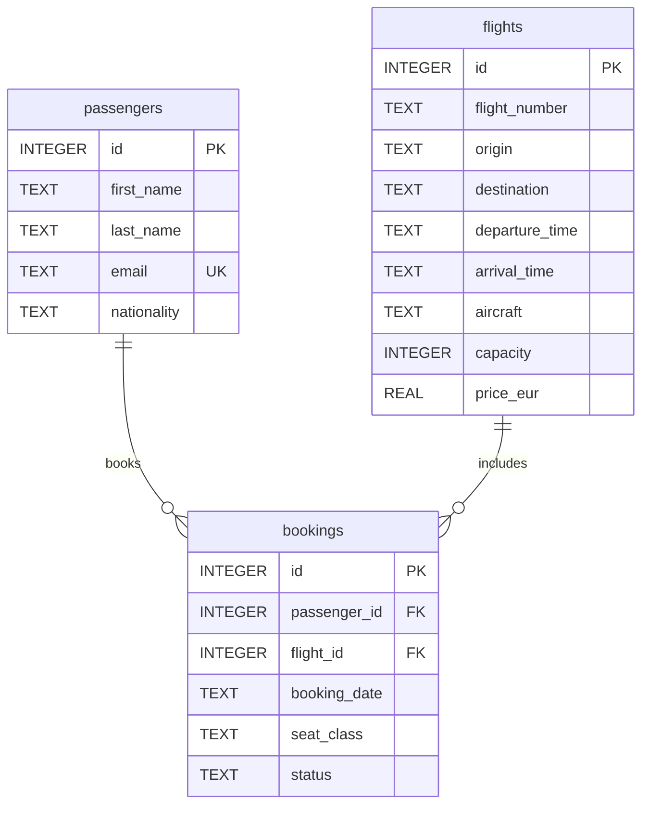

## 🎯 Objective

This is project 1 from the **Cahier de Vacances Data & IA 2026** (MachineLearnia). I ran it end to end: schema, seed data, queries, aggregates, then a recommendation I would actually put in front of a director.

I play the analyst inside an airport booking system. The brief is narrow: **next summer, add one extra weekly flight to a destination we already serve. Which one, and whom should we target?**

## 🔍 The question

An extra slot only pays off if demand already repeats and the revenue can carry the aircraft. That meant joining three tables — passengers, flights, bookings — and ignoring cheap one-off tickets plus anything still `cancelled` or `pending`.

The dataset is deliberately small (15 passengers, 15 flights, 19 bookings): small enough to read by hand, rich enough for joins, `GROUP BY`, and a `LEFT JOIN` that surfaces a passenger who never booked.

## 🗂️ Schema

In-memory SQLite, queried from Python through pandas. Three tables; a booking ties one passenger to one flight.



- `passengers`: 15 rows, unique `email`
- `flights`: 15 rows, **13 departing from Nice**
- `bookings`: 19 rows; `seat_class` is economy, business, or first; `status` is confirmed, cancelled, or pending

## 💻 Queries

Two queries I wrote for the business question — recurring confirmed revenue on one side, forgotten customers on the other.

**Confirmed revenue, destinations with repeat demand:**

```sql
SELECT
  f.destination,
  SUM(f.price_eur) AS total_revenue,
  COUNT(*)         AS nb_bookings
FROM bookings b
JOIN flights f ON f.id = b.flight_id
WHERE b.status = 'confirmed'
GROUP BY f.destination
HAVING COUNT(*) > 1
ORDER BY total_revenue DESC;
```

**Passenger with no booking at all:**

```sql
SELECT p.first_name, p.last_name, p.email
FROM passengers p
LEFT JOIN bookings b ON b.passenger_id = p.id
WHERE b.id IS NULL;
```

## 📈 Results

Statuses: **16 confirmed**, **2 cancelled**, **1 pending**.

Six flights sit under 100 €; the cheapest is Barcelona at **78 €**. Mean ticket price across the schedule: **184.20 €**. Only **AF5501 (650 €)** and **AF5502 (680 €)** sit above that average — both fly to JFK.

The Tanaka passenger is **Yako Tanaka**, Japanese. She is in first on AF5501 (seat 2A).

Confirmed revenue by destination: New York JFK **3280 €** (5 bookings), Paris CDG **388 €** (4), then Istanbul 160, Athens 145, London 120, Frankfurt 112, Nice 95, Dublin 89, Barcelona 78 (one booking each).

Recurring demand only (`HAVING nb_bookings > 1`):

| destination | total_revenue | nb_bookings |
|-------------|---------------|-------------|
| New York JFK | 3280 € | 5 |
| Paris CDG | 388 € | 4 |

I plotted that revenue with matplotlib: JFK towers over CDG.


AF5501 (Nice → JFK), confirmed passengers, all in premium cabin:

- Hugo Bernard — first 1A
- Camille Thomas — business 3B
- Yako Tanaka — first 2A
- Liam Smith — business 5B

Repeat bookers (≥ 2 bookings, any status): Hugo Bernard, Emma Dubois, Alice Martin, Lucas Moreau, Liam Smith (2 each).

Orphan passenger: **Noah Leroy**.

## 💡 Recommendation

**Add the extra weekly flight on Nice → New York JFK.** It is the only destination that stacks volume, revenue, and a premium cabin. Paris CDG does repeat, but 388 € does not fund a long-haul.

Target the five loyal passengers, and re-engage Noah Leroy: he is already in the database and has never booked.

## 🎓 What I learned

- A `WHERE status = 'confirmed'` filter rewrites the entire revenue story.
- `HAVING` splits one-off destinations from demand that actually repeats.
- `LEFT JOIN … WHERE b.id IS NULL` finds people to call back more reliably than hunting orphans by eye.
- A recommendation fits in one sentence once the numbers are clean.
