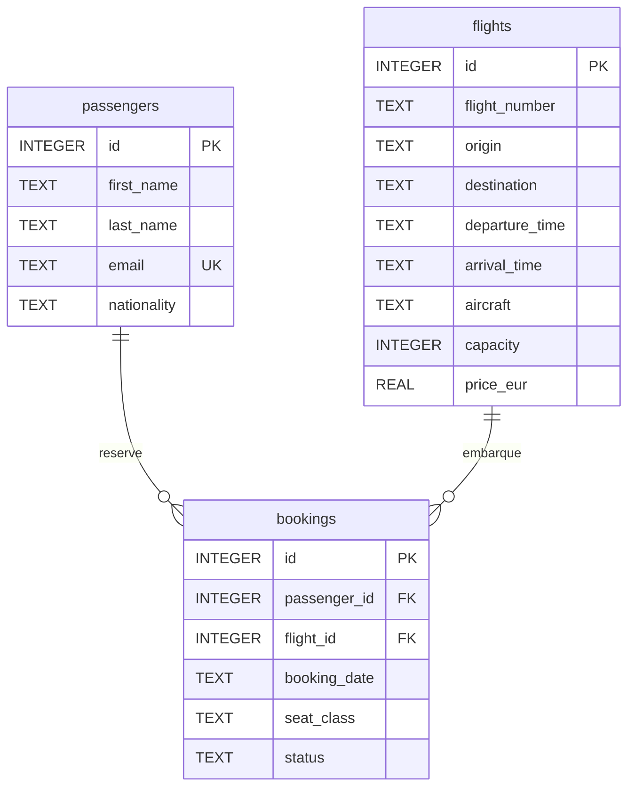

## 🎯 Objectif

Premier projet du **Cahier de Vacances Data & IA 2026** (MachineLearnia). Je l'ai mené de bout en bout : schéma, peuplement, requêtes, agrégats, puis une reco que je pourrais poser sur le bureau d'un directeur.

Je me place en analyste d'un système de réservation aéroportuaire. La question est simple : **l'été prochain, on ajoute un vol hebdomadaire sur une destination déjà desservie. Laquelle, et qui cibler ?**

## 🔍 Problématique

Ajouter un créneau n'a de sens que s'il existe déjà une demande qui se répète, et un chiffre d'affaires qui justifie l'avion. Il fallait donc croiser trois tables — passagers, vols, réservations — sans se laisser distraire par les vols cheap ou les statuts `cancelled` / `pending`.

Le jeu de données est volontairement compact (15 passagers, 15 vols, 19 réservations) : assez petit pour tout relire à l'œil, assez riche pour des jointures, des `GROUP BY` et un `LEFT JOIN` qui révèle un passager fantôme.

## 🗂️ Schéma

SQLite en mémoire, interrogé depuis Python via pandas. Trois tables, une réservation relie un passager à un vol.



- `passengers` : 15 lignes, `email` unique
- `flights` : 15 lignes, dont **13 au départ de Nice**
- `bookings` : 19 lignes ; `seat_class` vaut economy, business ou first ; `status` vaut confirmed, cancelled ou pending

## 💻 Requêtes

Deux requêtes que j'ai écrites pour coller à la question métier — le CA récurrent d'un côté, les clients oubliés de l'autre.

**CA confirmé, destinations à demande récurrente :**

```sql
SELECT
  f.destination,
  SUM(f.price_eur) AS total_revenue,
  COUNT(*)         AS nb_bookings
FROM bookings b
JOIN flights f ON f.id = b.flight_id
WHERE b.status = 'confirmed'
GROUP BY f.destination
HAVING COUNT(*) > 1
ORDER BY total_revenue DESC;
```

**Passager sans aucune réservation :**

```sql
SELECT p.first_name, p.last_name, p.email
FROM passengers p
LEFT JOIN bookings b ON b.passenger_id = p.id
WHERE b.id IS NULL;
```

## 📈 Résultats

Statuts : **16 confirmed**, **2 cancelled**, **1 pending**.

Six vols sous 100 € ; le plus bas est Barcelone à **78 €**. Prix moyen des vols : **184,20 €**. Seuls **AF5501 (650 €)** et **AF5502 (680 €)** dépassent cette moyenne — les deux partent vers JFK.

Passagère Tanaka : **Yako Tanaka**, Japonaise. Elle voyage en first sur AF5501 (siège 2A).

CA confirmé par destination : New York JFK **3280 €** (5 résas), Paris CDG **388 €** (4), puis Istanbul 160, Athènes 145, Londres 120, Francfort 112, Nice 95, Dublin 89, Barcelone 78 (une résa chacune).

Demande récurrente uniquement (`HAVING nb_bookings > 1`) :

| destination | total_revenue | nb_bookings |
|-------------|---------------|-------------|
| New York JFK | 3280 € | 5 |
| Paris CDG | 388 € | 4 |

J'ai tracé ce CA en barres avec matplotlib : JFK écrase CDG.


AF5501 (Nice → JFK), passagers confirmés, tous en cabine premium :

- Hugo Bernard — first 1A
- Camille Thomas — business 3B
- Yako Tanaka — first 2A
- Liam Smith — business 5B

Fidèles (≥ 2 résas, tous statuts) : Hugo Bernard, Emma Dubois, Alice Martin, Lucas Moreau, Liam Smith (2 chacun).

Passager orphelin : **Noah Leroy**.

## 💡 Recommandation

**Renforcer Nice → New York JFK.** C'est la seule destination qui combine volume, CA et cabine premium. Paris CDG a de la récurrence, mais 388 € ne paient pas un long-courrier.

Cibler les cinq fidèles, et relancer Noah Leroy : il est dans la base, il n'a encore rien réservé.

## 🎓 Apprentissages

- Un `WHERE status = 'confirmed'` change tout le CA.
- `HAVING` sépare le bruit des destinations à une résa du signal récurrent.
- Un `LEFT JOIN … WHERE b.id IS NULL` trouve les clients à relancer mieux qu'un anti-join mental.
- Une reco tient en une phrase si les chiffres sont propres.
